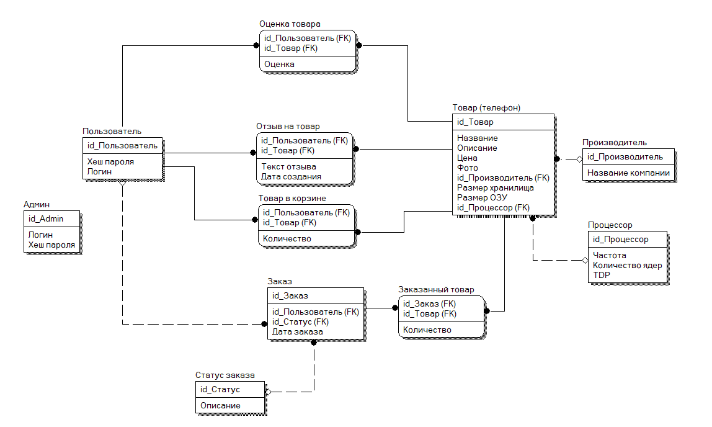

# Интернет-магазин мобильных телефонов
Учебный проект для курса по MS .Net

## Модель данных

## Пользователи
- Покупатель
- Админ

## Основные сущности
- Товар
  - название
  - описание
  - фото
  - рейтинг пользователей (0.0 - 5.0)
  - отзывы пользователей
- Корзина пользователя
  - пользователь, кому принадлежит
  - список товаров (товар, кол-во)
- Заказ
  - пользователь, сделавший заказ
  - дата заказа
  - статус заказа (в пути, доставлен, отменён)
  - Товары в заказе (тип товара, количество)

## Описание
Пользователь может просматривать товары, ставить им оценку, оставлять отзывы и добавлять товары себе в корзину.

Пользователь может сделать заказ, в который попадут все товары из его корзины. После этого корзина опустеет, и в системе появится новый заказ.

Админ может создавать, редактировать и удалять товары. Админ имеет доступ на редактирование корзин всех пользователей. Админ может удалять оценки и отзывы пользователей.

Данный проект моделирует работу большого распределительного центра, клиентами которогоявляются более мелкие организации
(ремонтные мастерские, маленькие магазины техники, и т. д.). Поэтому ситуация, когда клиент делает большой заказ, состоящий из большого количества разных телефонов, абсолютно возможна и имеет смысл.
